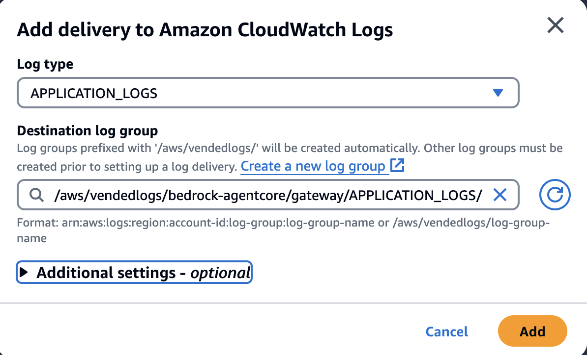
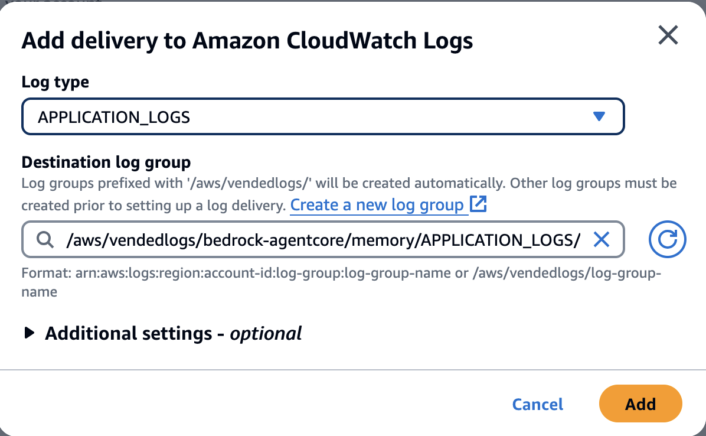

### Step 4: AgentCore Observability

[AgentCore Observability](https://docs.aws.amazon.com/bedrock-agentcore/latest/devguide/observability.html) equips the Runtime, Memory, and Gateway services with monitoring and tracing capabilities. Observability data is generated using Amazon OpenTelemetry instrumentation and is integrated with Amazon CloudWatch and AWS CloudTrail. These integrations provide comprehensive visibility into agent applications, enabling detailed tracing, debugging, and monitoring of AI agent performance in production environments. Engineering and operations teams can use these features to observe operational metrics, detect issues, and maintain the quality and reliability of deployed AI systems.

This foundation enables layers of production observability:
1. **GenAI Observability Dashboard** – CloudWatch’s purpose‑built view for AI agents with real‑time metrics, session analytics, trace visualizations, and error breakdowns for rapid diagnosis and optimization.
2. **CloudWatch Metrics** – Automatically published numerical indicators (invocations, latency, duration, sessions, error rates) for Runtime, Memory, and Gateway that power dashboards, alerts, and trend analysis.
3. **CloudWatch Logs** – Structured, time‑stamped application and system logs (including span/log records) used for deep troubleshooting and forensic analysis.
4. **AWS CloudTrail** – Immutable audit trail of management and data‑plane API activity (who did what, when, and from where) for security monitoring and compliance.


Now that your agent is deployed to AgentCore Runtime and integrated with Memory and Gateway, let's explore each observability layer in detail.

## 4.1 Understanding AgentCore's Built-in Observability

AgentCore provides comprehensive built-in observability to help monitor, debug, and optimize AI agents in production environments. Using CloudWatch’s dedicated GenAI Observability dashboard, developers and operators can access layered insights about agent activities, session behavior, and operational traces—all with minimal configuration.

### Agents

By default, AgentCore forwards agent traces to **CloudWatch GenAI Observability**. To view them, open CloudWatch → GenAI Observability → Bedrock AgentCore. From here you can review agent activity, drill into sessions, and open traces for detailed analysis.


The Agents view provides a high‑level performance overview across all deployed agents:
- **Session distribution** by agent and time period
- **Error rate visualization** and performance trends  
- **Agent comparison** for multi-agent deployments
- **Real-time activity monitoring** and usage patterns

### Sessions

The Sessions view shows the list of all the sessions associated with all agents in your account, with filters and drill‑downs that make it easy to investigate behavior for a specific session.


Use the Sessions view to:
- **Find and filter sessions** by session ID, agent name, status, duration, or time range to quickly locate the conversation you care about.
- **Open a session detail dashboard** by clicking a row to see per‑session metrics (latency, errors, span count), message timeline, and related resources.
- **Trace a conversation end‑to‑end** by jumping from the session to its associated traces and spans, preserving context with `sessionId` and `traceId` correlation.
- **Compare behavior across sessions** to spot outliers (e.g., unusually high latency, repeated tool failures, or long conversations).

What you learn from Sessions:
- **Lifecycle and outcome** – when the session started/ended, how long it lasted, and whether any errors occurred.
- **Engagement patterns** – number of turns, gaps between messages, and overall conversation depth.
- **Context usage** – whether Memory was accessed (e.g., `RetrieveMemoryRecords`, `CreateEvent`) during the session.
- **Tool utilization** – which Gateway tools were invoked and their contribution to total time (via linked traces).

Tips:
- Start here when you have a user‑reported issue; filter by timeframe and scan for abnormal duration or error indicators, then drill into traces.
- Use the same time range across Sessions, Traces, and Logs to keep investigations aligned.

### Traces

The Traces view lists all request traces emitted by your agents. Use it to find, analyze, and export end‑to‑end executions:

- Use **Filter traces** to search by time range, duration, status, or attributes.
- **Sort columns** (e.g., duration, start time) to prioritize what needs attention.
- From **Actions**, open **Logs Insights** to correlate spans with structured logs, or **Export selected traces** for offline analysis.


**Working with Traces:**
- **Filter by latency patterns** - Find all traces exceeding SLA thresholds
- **Error correlation analysis** - Identify patterns in failed requests
- **Component bottleneck identification** - Determine which spans contribute most to latency
- **Export selected traces** for offline analysis and reporting


## 4.2 AgentCore Observability Metrics

AgentCore automatically publishes **built-in observability metrics** for all primitives Runtime, Memory, Gateway, and Tools to **Amazon CloudWatch** under the namespace `AWS/Bedrock-AgentCore`. These metrics give you real-time visibility into request activity, latency, error rates, session usage, and performance. You can use them to build dashboards, configure alarms, and analyze trends for production operations.


### Navigating to AgentCore Metrics in CloudWatch

1. **Open CloudWatch Console**
   - Navigate to the **CloudWatch** service in the AWS Console.
   - Select **Metrics** from the left navigation panel.
   - Click **All metrics**.

2. **Locate AgentCore Metrics**
   - In the metrics browser, select the namespace **AWS/Bedrock-AgentCore**.
   - Explore the available dimension combinations for each resource type.

3. **Filter by Resource**
   - Use the search bar to enter the ARN or name of your resource.
   - Examples: `customer_support_agent`, `CustomerSupportMemory`, or `customersupport-gw`.

### Runtime Metrics

Runtime metrics capture how your agent handles requests in production and how users experience responsiveness.

**Key Metrics to Monitor**
- **Invocations** – Total requests received by the agent, showing usage and peak load periods.
- **Latency** – End-to-end response time (request to final token), including model inference, memory lookups, and tool execution.
- **Sessions** – Number of active agent sessions, useful for capacity planning and engagement analysis.
- **Error Metrics**:
  - **User Errors** – Invalid requests (400), missing resources (404), or permission errors (403).
  - **System Errors** – Internal service errors (500) that may indicate infrastructure issues.
  - **Throttles** – Requests rejected due to TPS or quota limits (429).


### Memory Metrics

Memory metrics measure how efficiently the agent stores and retrieves conversation context, and how background processing maintains memory quality over time.

**Key Metrics to Monitor**
- **Latency** – End-to-end processing time for memory operations.  
- **Invocations** – Total number of API requests to the Memory service.  
- **System Errors** – Memory API calls that failed with AWS server-side errors (5xx).  
- **User Errors** – Memory API calls that failed with client-side errors (4xx).  
- **Errors** – Total errors across control-plane and data-plane operations, including ingestion failures.  
- **Throttles** – Requests throttled (429), not counted as invocations or errors.  
- **Creation Count** – Number of new memory events and records created.  


### Gateway Metrics

Gateway metrics provide visibility into tool execution performance, MCP protocol health, and target distribution.

**Key Metrics to Monitor**
- **Invocations** – Total requests made to Gateway Data Plane APIs.  
- **Throttles (429)** – Requests throttled due to exceeded limits.  
- **System Errors (5xx)** – Requests that failed due to server-side issues.  
- **User Errors (4xx)** – Requests that failed due to client errors (excluding throttles).  
- **Latency** – Time from receiving a request until the first response token is sent.  
- **Duration** – Full end-to-end request time until the final response token is sent.  
- **TargetExecutionTime** – Time taken by the target (Lambda, API) to execute, excluding Gateway overhead.  
- **TargetType** – Distribution of requests served by target type (MCP, Lambda, OpenAPI).  


### Best Practices for Metrics
- **Dashboards** – Combine Runtime, Memory, and Gateway metrics in a single CloudWatch dashboard.  
- **Alarms** – Configure CloudWatch Alarms for high latency, error rates, or throttling.  
- **Trends** – Monitor growth in `CreationCount` and Sessions to anticipate scaling needs.  
- **Correlation** – Combine metrics with spans and logs for deep troubleshooting.  

With these metrics in CloudWatch, you have baseline observability across AgentCore resources, enabling real-time monitoring and proactive alerting.

## 4.3 AgentCore Observability Spans

In addition to metrics, AgentCore can provide **structured spans** that capture fine-grained details about specific operations. Spans allow you to trace execution paths, measure operation latency, and debug failures in depth.  

### Memory Spans

AgentCore Memory supports spans for the following operations (when enabled):  
- **CreateEvent** – New memory event creation.  
- **GetEvent** – Retrieval of an existing memory event.  
- **ListEvents** – Listing all events within a session.  
- **DeleteEvent** – Deletion of a memory event.  
- **RetrieveMemoryRecords** – Retrieval of memory records for a namespace.  
- **ListMemoryRecords** – Listing available memory records.  

Each span includes attributes such as `memory.id`, `session.id`, `event.id`, `actor.id`, and flags (`throttled`, `error`, `fault`).  

### Viewing Spans

- **CloudWatch Logs** – Spans are stored as structured logs under `/aws/vendedlogs/bedrock-agentcore/memory/<memory_id>`.  
- **CloudWatch Application Signals** – Provides visualizations and end-to-end trace analysis.  

1. Open the **CloudWatch Console**.  
2. Navigate to **Logs** → **Log groups**.  
3. Find the log group under `/aws/vendedlogs/bedrock-agentcore/memory/<memory_id>`.  
4. Use **CloudWatch Application Signals** (GenAI Observability) for trace visualizations and span metrics.

*Screenshot Placeholder: CloudWatch Application Signals span view*


### Use Cases for Spans
- Identify bottlenecks in memory retrieval or event creation.  
- Debug failures in consolidation or extraction processes.  
- Correlate spans with metrics and logs for a full observability picture.  


By combining **metrics** (high-level monitoring) and **spans** (operation-level tracing), you gain comprehensive visibility into the behavior and performance of your AgentCore resources.

---

## 4.4 AgentCore Observability Logs

CloudWatch Logs capture detailed, time‑stamped events across AgentCore components. These structured JSON logs provide visibility into agent operations, background processing, and system behavior for deep troubleshooting and performance analysis.

Now that you have built a customer support agent system across Labs 1-4—creating a functional customer support agent prototype with local tools (Lab 1), enhancing it with persistent memory for conversation context and personalization (Lab 2), integrating with AgentCore Gateway to centrally manage shared tools and secure authentication (Lab 3), and deploying to AgentCore Runtime for production-ready auto-scaling with observability (Lab 4)—let's explore the detailed logs each component generates to help you monitor and debug your production agent system.

### Memory Logs - Setup and Navigation

**Enable Memory Log Delivery:**

1. **Navigate to your Memory resource** from Lab 2 in the AWS Console:
   - Go to Amazon Bedrock AgentCore → Memory → **CustomerSupportMemory** (created in Lab 2)

2. **Configure Log Delivery:**
   - In the **Observability** section, find **Log delivery**
   - Click **Add** to create a new log delivery configuration
   - Select **Log type**: `APPLICATION_LOGS`
   - **Destination log group**: `/aws/vendedlogs/bedrock-agentcore/memory/APPLICATION_LOGS/CustomerSupportMemory-xxxxxxxxxxxx`. The log group name will include an automatically generated ID suffix (like `CustomerSupportMemory-WcEhTTFp10`) unique to your Memory resource.
   - Click **Add** to enable log delivery

   

3. **Access Memory Logs in CloudWatch:**
   - Navigate to **CloudWatch** → **Logs** → **Log groups**
   - Find the log group: `/aws/vendedlogs/bedrock-agentcore/memory/APPLICATION_LOGS/CustomerSupportMemory-[auto-generated-ID]`
   - Click to open: **BedrockAgentCoreMemory_ApplicationLogs**

### Understanding Memory Log Structure

Memory logs provide detailed insight into background processing operations. Each log entry contains structured JSON with the following key fields:

```json
{
  "resource_arn": "arn:aws:bedrock-agentcore:<region>:<account-id>:memory/CustomerSupportMemory-ID",
  "event_timestamp": 1756957336547,
  "memory_strategy_id": "CustomerPreferences-EH93NK8WlQ", 
  "namespace": "support/customer/customer_001/preferences",
  "actor_id": "customer_001",
  "session_id": "7e68e007-8675-464d-864b-db6c97b2a078",
  "body": {
    "log": "Processing extraction input",
    "requestId": "58bc9c8c-4e84-40b6-bcf3-1161866443bb",
    "isError": false
  }
}
```

**Key Fields Explained:**
- **resource_arn** - Memory resource identifier for filtering logs across multiple memory instances
- **event_timestamp** - Timestamp for when the memory operation occured
- **memory_strategy_id** - Strategy type (`CustomerPreferences`, `CustomerSupportSemantic`) to track different memory processing approaches
- **namespace** - Organizational structure showing customer/context segmentation (`support/customer/{customer_id}/{type}`)
- **actor_id** - Customer or user identifier for session correlation
- **session_id** - Links memory operations to specific conversations for end‑to‑end tracing
- **body.log** - Human‑readable operation description for debugging
- **body.requestId** - Correlation ID linking memory operations to agent requests
- **body.isError** - Boolean flag for filtering successful vs failed operations

### Memory Processing Workflow in Logs

When your agent (from Lab 1) interacts with customers and stores conversation context using the Memory system (from Lab 2), you'll see this complete processing pipeline in the logs:

**1. Extraction Phase** (Converting conversations to memories):
```json
{"log": "Processing extraction input"}          // Starting extraction
{"log": "Starting to process Preference strategies"}  // Strategy-specific processing
{"log": "Extraction completed in 1674 ms"}     // Timing for performance analysis
{"log": "Extracted 1 memories"}                // Output quantity tracking
```

**2. Consolidation Phase** (Merging with existing memories):
```json
{"log": "Processing consolidation input"}       // Beginning consolidation
{"log": "Retrieving memories."}                 // Fetching existing memories
{"log": "Succeeded to retrieve 2 records."}    // Existing memory count
{"log": "1 memories require consolidation."}   // Processing decision
{"log": "Consolidating 2 facts with 3 related memories"}  // Merge operation details
```

**3. Storage Operations** (Updating memory store):
```json
{"log": "Performing UPDATE operation for memory."}  // Operation type decision
{"log": "Succeeded to upsert 1 records."}          // Database operation result
{"log": "Succeeded operation for record id mem-af46dbb9..."}  // Specific record tracking
{"log": "Succeeded to update 1 records."}          // Final confirmation
```

**4. Multiple Strategy Processing** (Parallel memory types):
- **CustomerPreferences** - Tracks user preferences and settings
- **CustomerSupportSemantic** - Captures conversation context and technical details
- Each strategy processes independently with separate timing and results

### Memory Log Use Cases

**1. Memory Performance Monitoring:**
- Track extraction and consolidation timing to identify processing bottlenecks
- Monitor memory creation rates and storage operation success patterns
- Analyze memory strategy efficiency across different customer types

**2. Memory Processing Debugging:**
- Debug failed extraction or consolidation operations using error flags
- Trace memory record lifecycle from creation to storage completion  
- Verify proper memory strategy execution and decision logic

**3. Memory Usage Analytics:**
- Track memory growth patterns across customer segments and namespaces
- Analyze memory consolidation frequency and effectiveness
- Identify opportunities for memory strategy optimization or tuning


### Gateway Logs - Setup and Navigation

**Enable Gateway Log Delivery:**

1. **Navigate to your Gateway resource** from Lab 3 in the AWS Console:
   - Go to Amazon Bedrock AgentCore → Gateways → **customersupport-gw** (created in Lab 3)

2. **Configure Log Delivery:**
   - In the **Observability** section, find **Log delivery**
   - Click **Add** to create a new log delivery configuration
   - Select **Log type**: `APPLICATION_LOGS`
   - **Destination log group**: `/aws/vendedlogs/bedrock-agentcore/gateway/APPLICATION_LOGS/customersupport-gw-xxxxxxxxxxxx`. The log group name will include an automatically generated ID suffix (like `customersupport-gw-dcbgswzb5p`) unique to your Gateway resource.
   - Click **Add** to enable log delivery

   

3. **Access Gateway Logs in CloudWatch:**
   - Navigate to **CloudWatch** → **Logs** → **Log groups**
   - Find the log group: `/aws/vendedlogs/bedrock-agentcore/gateway/APPLICATION_LOGS/customersupport-gw-[auto-generated-ID]`
   - Click to open: **BedrockAgentCoreGateway_ApplicationLogs**

### Understanding Gateway Log Structure

Gateway logs capture detailed MCP (Model Context Protocol) operations and tool execution flows. Each log entry contains structured JSON with the following key fields:

```json
{
  "resource_arn": "arn:aws:bedrock-agentcore:<region>:<account-id>:gateway/customersupport-gw-ID",
  "event_timestamp": 1756958992250,
  "body": {
    "id": "2",
    "log": "Received request for tools/call method",
    "isError": false
  },
  "account_id": "<account-id>",
  "request_id": "b2474cdc-b5dd-44b0-876d-8de900414ee3"
}
```

**Key Fields Explained:**
- **resource_arn** - Gateway resource identifier for filtering logs across multiple gateway instances
- **event_timestamp** - Precise timing for latency analysis and request sequencing
- **body.id** - Sequential request identifier within the gateway session for tracking operation order
- **body.log** - Human‑readable operation description detailing MCP protocol interactions
- **body.isError** - Boolean flag for filtering successful vs failed operations
- **account_id** - AWS account identifier for multi‑account deployments
- **request_id** - Unique correlation ID linking gateway operations to agent requests

### Gateway MCP Protocol Workflow in Logs

When your customer support agent (Lab 1) needs to use tools like `check_warranty_status` or `web_search` that you configured in Lab 3, the Gateway handles the MCP protocol interactions. Here's the complete flow you'll see in the logs:

**1. Gateway Initialization Phase**:
```json
{"log": "Started processing request with requestId: 0"}        // Request initiation
{"log": "Received request for initialize method"}             // MCP initialization
{"log": "Successfully processed request with requestId: 0"}   // Initialization complete
```

**2. Tool Discovery Phase**:
```json
{"log": "Started processing request with requestId: 1"}       // Discovery request start
{"log": "Received request for tools/list method"}             // Tool enumeration
{"log": "Successfully processed request with requestId: 1"}   // Available tools listed
```

**3. Tool Execution Phase** (Core functionality):
```json
{"log": "Started processing request with requestId: 2"}       // Tool call initiation
{"log": "Received request for tools/call method"}             // Tool invocation request
{"log": "Executing tool LambdaUsingSDK___check_warranty_status from target ME2UI4BINR"}  // Specific tool execution
{"log": "Successfully processed request with requestId: 2"}   // Tool execution complete
```

**4. Multiple Tool Operations** (Sequential execution):
```json
// Request ID 3: web_search tool
{"log": "Executing tool LambdaUsingSDK___web_search from target ME2UI4BINR"}

// Request ID 4: Another web_search tool 
{"log": "Executing tool LambdaUsingSDK___web_search from target ME2UI4BINR"}
```

### Gateway Tool Execution Analysis

**Tool Identification Pattern:**
- **Tool naming**: `LambdaUsingSDK___[function_name]` format indicates Lambda-backed tools from Lab 3
- **Target identification**: `ME2UI4BINR` represents the specific Lambda function you deployed 
- **Operation types**: `check_warranty_status`, `web_search` are the actual tools your customer support agent uses

**Performance Timing Analysis:**
From the timestamps, you can calculate tool execution times:
- **check_warranty_status**: 1,571ms (1756958992303 → 1756958993874)
- **web_search** (first): 1,194ms (1756959020038 → 1756959021232)  
- **web_search** (second): 794ms (1756959044840 → 1756959045634)

**Request Correlation:**
- Each tool call has a unique `request_id` for end‑to‑end tracing
- Sequential `id` numbers track operation order within the gateway session
- Successful operations show clear start → execution → completion patterns

### Gateway Log Use Cases

**1. Tool Performance Monitoring:**
- Identify slow‑executing tools by analyzing timestamp differences
- Track tool reliability through success/failure patterns
- Monitor target responsiveness across different Lambda functions

**2. MCP Protocol Debugging:**
- Verify proper initialization and tool discovery sequences
- Debug tool execution failures and timeout issues
- Analyze request ordering and concurrency patterns

**3. Tool Usage Analytics:**
- Track which tools are most frequently called
- Analyze tool execution patterns across different sessions
- Identify opportunities for tool optimization or caching

### Navigate to All Log Types

1. **Open CloudWatch Console** → **Logs** → **Log groups**
2. **Search patterns for your AgentCore resources:**
   - Memory: `/aws/vendedlogs/bedrock-agentcore/memory/APPLICATION_LOGS/CustomerSupportMemory-[auto-generated-ID]`
   - Runtime: `/aws/bedrock-agentcore/runtimes/customer_support_agent-DEFAULT`
   - Gateway: `/aws/vendedlogs/bedrock-agentcore/gateway/APPLICATION_LOGS/customersupport-gw-[auto-generated-ID]`
   - Each log group includes the resource name plus an automatically generated unique ID suffix
3. **Use Log Insights** for advanced querying and time‑range analysis

### Common Logs Insights Queries

```sql
-- Slow runtime responses (>5s)
fields @timestamp, traceId, sessionId, latency
| filter @logGroup like /bedrock-agentcore\/runtimes/ and latency > 5000
| sort @timestamp desc
| limit 20
```

```sql
-- Memory operation performance
fields @timestamp, operation, duration, memory_id
| filter @logGroup like /bedrock-agentcore\/memory/ and operation in ["CreateEvent","RetrieveMemoryRecords"]
| stats avg(duration), max(duration) by operation
```

```sql
-- Gateway tool execution overview
fields @timestamp, toolName, targetExecutionTime
| filter operation = "CallToolMcp"
| stats avg(targetExecutionTime), max(targetExecutionTime) by toolName
| sort avg(targetExecutionTime) desc
```

### Correlation Keys

All logs and traces include shared identifiers for end‑to‑end analysis:
- **traceId** – Correlates logs with GenAI Observability traces  
- **sessionId** – Groups requests within the same conversation  
- **requestId** – Tracks individual requests across components
