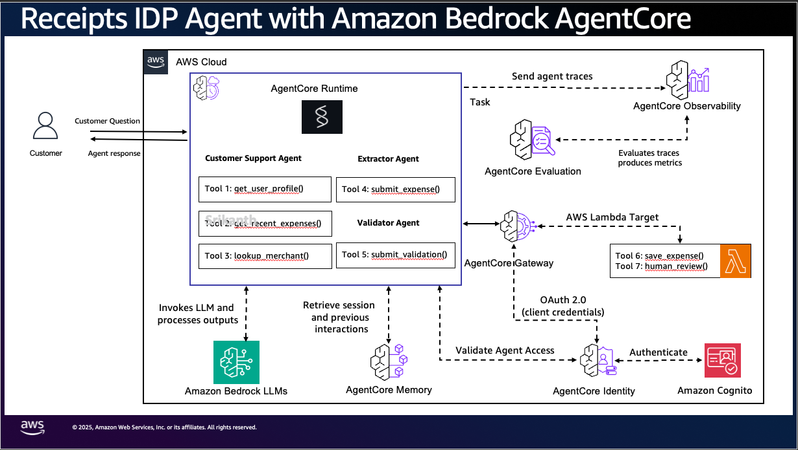
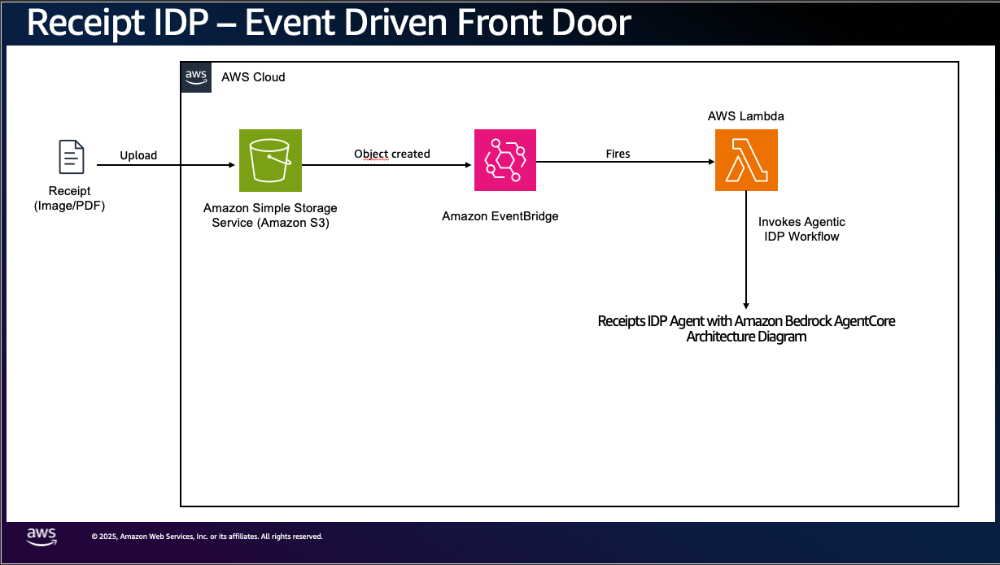

# Receipts IDP on Amazon Bedrock AgentCore, with its Evaluators

An **agentic** Intelligent Document Processing sample: a dual-agent pipeline on AgentCore
turns a **receipt** into a validated, persisted expense record, and a chat assistant
answers an employee's questions about their own expenses. It self-protects with a **model
degradation ladder** when a model tier is capacity-constrained.

It ships with an **evaluation suite** chosen from the business outward, not copied from a
list: every evaluator judges a decision a model makes, and every judge was contrast-tested
before it was trusted. Three evaluators run live in AgentCore; the rest run against
labelled data, locally or against the deployed stack.

> [!IMPORTANT]
> This sample is for experimental and educational purposes only. It demonstrates
> concepts and techniques but is not intended for direct use in production.

| | |
|---|---|
| **Time to deploy** | about 20-30 minutes the first time |
| **Running cost** | a few dollars a day: Bedrock and Textract on demand, DynamoDB on demand, Lambda, two AgentCore Runtimes, evaluation judge calls. Tear down when not testing |
| **Resources created** | one CloudFormation stack: two Runtimes, the Gateway with five tool Lambdas and a Cedar policy, three code-based evaluators and a live evaluation config, DynamoDB, S3, Cognito, SQS, AppConfig, EventBridge, KMS, CloudWatch |

Demo of the original pipeline: [demo.mp4](demo.mp4).

## What it does

A receipt lands in S3. Textract reads it, an **extractor** agent produces a structured
expense, and an independent **validator** agent checks it and acts on its decision by
calling one of two tools: save it automatically, or send it to a person. The tools are pinned
to the extractor's expense, so the validator chooses but cannot change what is written. The
expense is written through governed Gateway tools, with a Cedar policy blocking any automatic save of $2,000 or more whatever the
agents decided. When a receipt is held, a third model writes a short note for the reviewer.

A separate **chat** Runtime answers questions like "how much did I spend at Mr D.I.Y.?"
and follow-ups like "and at Starbucks?", read-only, for the signed-in user only.

## The AgentCore services

- **Runtime:** the pipeline Runtime and the chat Runtime (same code, separate so each is
  evaluated on its own traffic, [ADR-0018](docs/decisions/0018-separate-chat-runtime.md)).
- **Gateway:** five MCP tools backed by Lambda.
- **Policy:** Cedar on tool input.
- **Observability:** OpenTelemetry into CloudWatch, with the business outcome stamped on
  every trace.
- **Evaluations:** code-based evaluators, built-in and third-party judges, a live
  configuration per Runtime ([ADR-0017](docs/decisions/0017-evaluators-from-business-outcomes.md)).
- **Memory:** the agent integrates AgentCore Memory and degrades gracefully without it; the
  stack does not create a Memory resource by default.

## Architecture



The event-driven front door (upload, S3, EventBridge, trigger Lambda, Runtime):



The agent authenticates to the Gateway as itself (agent-as-principal, M2M Cognito): the
front door is an S3 event, so there is no logged-in user at run time. Per-user data
separation lives at the data layer (Expenses partitioned by `userId`). Full walkthrough in
[docs/ARCHITECTURE.md](docs/ARCHITECTURE.md).

## Deploy

```bash
./deploy.sh us-west-2       # the whole stack, then the chat live-evaluation config
uv run --with boto3 python scripts/test_invoke.py --region us-west-2
./destroy.sh us-west-2      # removes everything billable
```

Prerequisites: the AWS CLI with credentials, Node.js 20 or later, and `uv`. **No local
container engine is needed**: the Runtime images are built in AWS CodeBuild from the
uploaded source ([ADR-0005](docs/decisions/0005-container-build-over-codezip.md)), and the
evaluator Lambda is packaged with `uv`. The four ladder models must be available as global
inference profiles in the account (`aws bedrock list-inference-profiles`).

## Evaluation

### How the evaluators were chosen

Two frameworks, applied together:

- **Work backwards from the business.** What would you measure no matter how the work is
  done? The test: state the metric without naming the agent, its model or its tools.
  Imagine a person typing receipts in by hand; does the number still exist? That gives
  the scoreboard: straight-through rate, dollar-weighted extraction error, control
  breaches, review-queue precision; for chat, self-service resolution and answer accuracy.
- **Work forwards from the architecture.** Which failures does this design make likely?
  An extractor inventing values its OCR did not provide; a validator making the right call
  for the wrong reason; a chat assistant forgetting earlier turns. Evaluators aimed at
  these are diagnostics: they explain why a scoreboard number moved.

Every evaluator had to pass four rules: it judges a decision a model makes, against a
right answer or a clear reference; one question per evaluator; a contrast test first
(pairs of cases that differ in one thing, where the verdict must flip); and product
changes only where a team would make them anyway.

### The evaluators

| Evaluator | Kind | Judges | Where it runs |
|---|---|---|---|
| `ReceiptsThresholdControl` | code-based, deployed | Did anything at or above the Cedar limit save automatically? A control monitor, not agent quality | **Live**, every pipeline session |
| `ThirdParty.DeepEval.ConversationCompleteness` | third-party judge | Share of the employee's requests that were handled (self-service resolution) | **Live**, every chat session |
| `ThirdParty.DeepEval.KnowledgeRetention` | third-party judge | Whether earlier turns are remembered. Diagnostic only: noisy per conversation | **Live**, every chat session |
| `ReceiptsExtractionAccuracy` | code-based, deployed | Every extracted field against a labelled receipt; value is the dollar gap on the total | Labelled data |
| `ReceiptsRoutingOutcome` | code-based, deployed | The validator's save-or-review call, judged on the extraction it was shown | Labelled data |
| `Builtin.ToolParameterAccuracy` | built-in judge | Did the extractor put a value in the record that its own input never contained? | Labelled data, on the extractor's part of the trace |
| `Builtin.GoalSuccessRate` with assertions | built-in judge | Did the validator name the actual problem, not only route correctly? | Labelled data, on the trace through the validator |
| `Builtin.Correctness` with expected answers | built-in judge | Each chat answer against its expected answer | Labelled conversations |

Online configurations cannot carry ground truth, which is why the labelled evaluators run
on demand rather than live. Two traps shaped the design; both are in
[ADR-0017](docs/decisions/0017-evaluators-from-business-outcomes.md):

- **The whole-session trap.** The extractor, validator and note writer share one trace, so
  a judge scoring the extractor also sees later inputs that repeat the extractor's output,
  and passes invented values. The harness sends each judge only the part of the trace up to
  the model it is judging.
- **No ground truth, no view of correctness.** ConversationCompleteness scores a confident
  wrong answer as handled; only Correctness with an expected answer catches it. That is why
  both are kept.

### Running the evaluators

**Live:** nothing to do. `ReceiptsLive` (in `agentcore.json`) and `ReceiptsAgent_ChatLive`
(created by `scripts/chat_online_eval.py`, because the CloudFormation schema does not yet
accept managed third-party evaluator ids) score sessions after they go idle. Results land in
CloudWatch under `/aws/bedrock-agentcore/evaluations/results/`.

**Against the deployed stack**, with the labelled set in `evals/fixtures/`:

```bash
cd evals
uv venv --python 3.12 && uv pip install -r ../app/receiptsagent/requirements.txt "bedrock-agentcore>=1.22" pillow
.venv/bin/python run_deployed.py              # uploads the receipts, runs the chat conversations
.venv/bin/python score_saved.py --run out/deployed-<id>        # routing, right reason, invented values
.venv/bin/python score_chat.py  --run out/deployed-chat-<id>   # completeness, retention, correctness
```

**Locally**, with the real agent code against a stand-in Gateway: `run_dataset.py` and
`run_chat.py` produce the same output shapes, so the same scorers apply. See
[evals/README.md](evals/README.md).

## Front door, run ledger and chat

**Event-driven front door.** Drop a receipt in the inbox bucket and the pipeline runs:

```bash
aws s3 cp receipt.png s3://receipts-inbox-<account>-<region>/receipts/user-001/receipt.png
```

S3 emits `Object Created`, an EventBridge rule scoped to `receipts/` fires the trigger
Lambda, and it invokes the pipeline Runtime with `{s3_uri, user_id}`. The `user_id` comes
from the key (`receipts/<user_id>/<file>`), defaulting to `user-001`. A DLQ and retries make
a failed trigger visible rather than dropping a receipt.

**Run ledger.** Every receipt run emits one event; a writer Lambda records one row per
receipt in `ProcessingRuns` (processed, needs_review, deferred or error), and a
`status=error` rule notifies an SNS topic ([ADR-0015](docs/decisions/0015-processing-runs-ledger.md)):

```bash
uv run --with boto3 python scripts/receipt_status.py --status needs_review
```

**Chat.** A read-only assistant on its own Runtime:

```bash
uv run --with boto3 python scripts/chat.py --user user-001    # one session for the whole chat
# you> how much did I spend at Mr D.I.Y.?
# you> and at Starbucks?
uv run --with boto3 python scripts/ask.py --user user-001 "what are my most recent expenses?"
```

The REPL keeps one Runtime session, so follow-ups see the earlier turns. History is held
per verified user and session: a session id replayed under another identity starts empty.
The `user_id` is never taken from the request body; it comes from a KMS-signed identity
token the agent verifies, and the read tools are pinned to that user
([ADR-0016](docs/decisions/0016-conversational-identity-no-idor.md)).

## Layout

- `agentcore/`: `agentcore.json` (Runtimes, Gateway, Cedar, evaluators, live config) and the
  CDK app (`cdk/lib/cdk-stack.ts`, `cdk/lib/infra-construct.ts`).
- `app/receiptsagent/`: the agent. `config.py` is the single env-read seam.
- `evaluators/business_outcomes/`: the code-based evaluators, deployed as one Lambda.
- `evals/`: the evaluation harness, labelled receipts and conversations.
- `lambdas/`: Gateway tools, trigger, controller, drain, ledger writer, Transaction Search.
- `scripts/`, `tests/`, `docs/`.

## Docs

- [docs/ARCHITECTURE.md](docs/ARCHITECTURE.md): how it works.
- [docs/decisions/](docs/decisions/): 18 ADRs, the why behind each choice.
- [docs/CONFIGURATION.md](docs/CONFIGURATION.md): env vars, the ladder config, Cedar, tuning.
- [docs/tutorial.md](docs/tutorial.md): a guided run and experiments.
- [docs/deployment.md](docs/deployment.md): deploy, destroy, local dev, live tests.
- [evals/README.md](evals/README.md): running and extending the evaluation suite.
